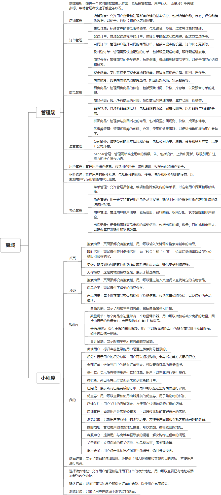

 

    
 

公司拥有上百套具有自主知识产权的软件系统，详情请查看码云首页或公司官网

 
<h1>商城小程序</h1>

<a href="https://www.haishi.net.cn/">公司官网</a> ｜ <a href="https://www.haishi.net.cn/">在线体验</a>

 

## 系统介绍

商城，团购、秒杀服务、预售等各种活动，多商户
商城，团购、秒杀服务、预售等各种活动，多商户
本项目名称为商城小程序管理系统，是一款面向商家的电商管理软件。该系统旨在帮助商家高效管理店铺运营的各个方面，包括商品管理、订单处理、售后服务、数据分析等。
本项目从用户层面可以分为两个端：
- 管理端：公司内部管理员用户使用，可以进行店铺管理、商品管理、订单管理、售后订单管理、数据看板查看等。
- 小程序端：外部客户使用，可以浏览商品、下单、支付、查看订单等。
                

## 系统功能介绍

### 系统包含终端说明

管理端（WEB）、用户端（微信小程序）

| 序号 | 模块                | 模块说明 |
| ---- | ------------------- | -------- |
| 1    | FWY-SHOP-HLG-SERVER | 服务端   |
| 2    | FWY-SHOP-HLG-MANAGE | 管理端   |
| 3    | FWY-SHOP-HLG-MP     | 小程序   |

### 系统功能结构

### 系统功能说明

- 数据看板：提供店铺经营数据概览，帮助商家实时掌握经营状况。
- 店铺管理：用于管理店铺的基本信息，例如店铺名称、联系方式、地址等。
- 订单管理：处理用户的订单，包括查看订单详情、确认订单、发货、处理退款等。
- 商品管理：对商品进行上架、下架、修改信息、库存管理等操作。
- 出库记录：记录商品的出库信息，包括出库时间、商品名称、数量、经手人等。

## 系统主要界面

## 系统技术说明

### 代码模块说明

| 序号 | 目录                       | 目录说明 |
| ---- | -------------------------- | -------- |
| 1    | FWY-SHOP-HLG-SERVER/target | --       |
| 2    | FWY-SHOP-HLG-SERVER/.idea  | --       |
| 3    | FWY-SHOP-HLG-SERVER/src    | --       |

### 系统技术选型

#### 开发语言/框架

JAVA（JDK1.8）
前端框架：VUE2

#### 服务中间件

Nginx
Tomcat

#### 数据库

MySQL（5.7+）

#### 其他说明

无

## 系统演示/商用

请扫码添加客服微信获取演示地址和系统详细资料。

如果您想基于商城小程序进行商业化交付或定制开发服务，我们提供有偿的技术服务支持，合作模式不限，欢迎沟通！

公司官网地址： <a href="https://www.haishi.net.cn/">https://www.haishi.net.cn</a>

联系客服获取专业回答。

## 使用须知

1、 本项目商用必须获得版权所有者的授权。

2、 未经允许本项目代码不允许二次出售。

